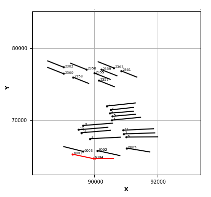

#  Поиск пересечения целей бурения <br> (Intersections drilling targets) 
Авто-поиск пересечения целей бурения (проектных скважин) кросс-функциональных команд и формирование статистики по пересекающимся командам.

---

## 📥 Входные данные 
Ожидается Excel-файл, где первый лист содержит следующую структуру:

- Необходимая таблица начинается с 3-й строки (`header=2`) 
- Строка 3: имена столбцов, с которых начинается считывание данных
- Данные начинаются с 4-й строки

### 🔸 Обязательные столбцы:
| Название в Excel   | Описание                                                                 |
|--------------------|--------------------------------------------------------------------------|
| `Команда`          | Название команды или отдела                                              |
| `Месторождение`    | Название месторождения                                                   |
| `КП`               | Кустовая площадка                                                        |
| `Объект`           | Объект разработки                                                        |
| `Назначение`       | Тип проектной скважины (1 — добыча, 2 — нагнетание)                      |
| `Скважина - Забой` | Номер скважины                                                           |
| `T1 X`             | Координата X точки входа в пласт (Т1)                                    |
| `T1 Y`             | Координата Y точки входа в пласт (Т1)                                    |
| `T1 Z`             | Координата Z точки входа в пласт (Т1)                                    |
| `T3 X`             | Координата X конца горизонтального участка (Т3)                          |
| `T3 Y`             | Координата Y конца горизонтального участка (Т3)                          |
| `T3 Z`             | Координата Z конца горизонтального участка (Т3)                          |
| `Комментарий`      | Комментарий по проекту                                                   |
| `2й ствол T3 X`    | Координата X конца горизонтального участка (Т3) 2го ствола (при наличии) |
| `2й ствол T3 Y`    | Координата Y конца горизонтального участка (Т3) 2го ствола (при наличии) |
| `2й ствол T3 Z`    | Координата Z конца горизонтального участка (Т3) 2го ствола (при наличии) |

### 🔹 Пример содержимого:
| Команда | Месторождение  | КП | Объект | Назначение | Скважина - Забой | T1 X  | T1 Y  | T1 Z | T3 X  | T3 Y  | T3 Z | Комментарий |
|---------|----------------|----|--------|------------|------------------|-------|-------|------|-------|-------|------|-------------|
| НТЦ     | Вынгапуровское | 13 | БВ8    | 1          | 100Г             | 55318 | 69821 | 2555 | 55558 | 69327 | 2567 | 2025 г      |

---

## ⚙️ Параметры расчета
Перед запуском пользователь должен указать два параметра, которые влияют на определение пересечений:

- **Минимальное расстояние, м** - минимально допустимое расстояние между скважинами 
для исключения пересечений (по умолчанию 150 м)
- **Разница абсолютных отметок, м** - максимальная разница по глубине (Z), 
при которой скважины считаются находящимися в одном пласте (30 м)

---

## 📤 Результат расчёта
После завершения расчета создаётся Excel-файл в папке 📁Result со следующим содержимым:

### 🔹 Лист `Цели`
Основной лист с исходными данными и результатом анализа по всем целям (скважинам)  
Добавлен новый столбец `Пересечения` в конец таблицы:

| Столбец                                         | Описание                                                                        |
|-------------------------------------------------|---------------------------------------------------------------------------------|
| `Пересечения` <br/>`скв (команда/куст/объект)`  | Список скважин, с которыми обнаружены пересечения в пределах заданных критериев |


### 🔹 Лист `Статистика`
Статистика по всем пересечениям:

| Месторождение       | Количество пересечений | Пересекающиеся команды |
|---------------------|------------------------|------------------------|
| Вынгапуровское      | 4                      | НТЦ, ПИ                |
| Карамовское         | 2                      | Альфа, ПИ              |
| ...                 | ...                    | ...                    |


### 🔹 Листы по месторождениям
Каждое месторождение, где были обнаружены пересечения, вынесено на отдельный лист. 

На этих листах:
- представлена информация только по **пересекающимся** проектным скважинам
- построена визуализация с проектным размещением всех скважин
- красным цветом выделены пересекающиеся скважины

Также в папку 📁Result сохраняются картинки со всеми проектными скважинами по месторождениям.

**Пример визуализации:**  



**Пример результата:**  
[Результат](Result)

---

## 🛠️ Упаковка в .exe (опционально)
Если требуется запуск без Python, проект можно собрать в `.exe` с помощью PyInstaller:  
### 🔹 Простой вариант:

```bash
pip install pyinstaller
pyinstaller --onefile --windowed --name=target GUI.py
```

### 🔹 Оптимальный:

```bash
pyinstaller --noconfirm --onefile --windowed ^
  -i "logo.ico" ^
  --add-data "C:\python\Lib\site-packages\customtkinter;customtkinter/" ^
  --add-data "logo.png;." ^
  --add-data "point.png;." ^
  --name=target GUI.py
```

---

## 🖥️ Графический интерфейс

Программа имеет минимальный графический интерфейс:  


---

## 📄 License
Проект лицензирован под [MIT License](LICENSE).